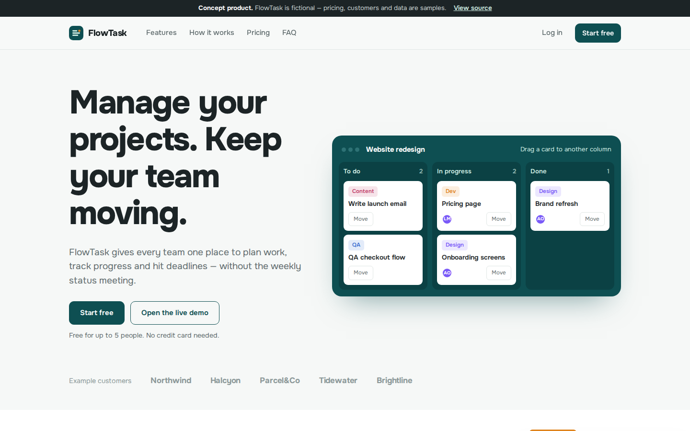
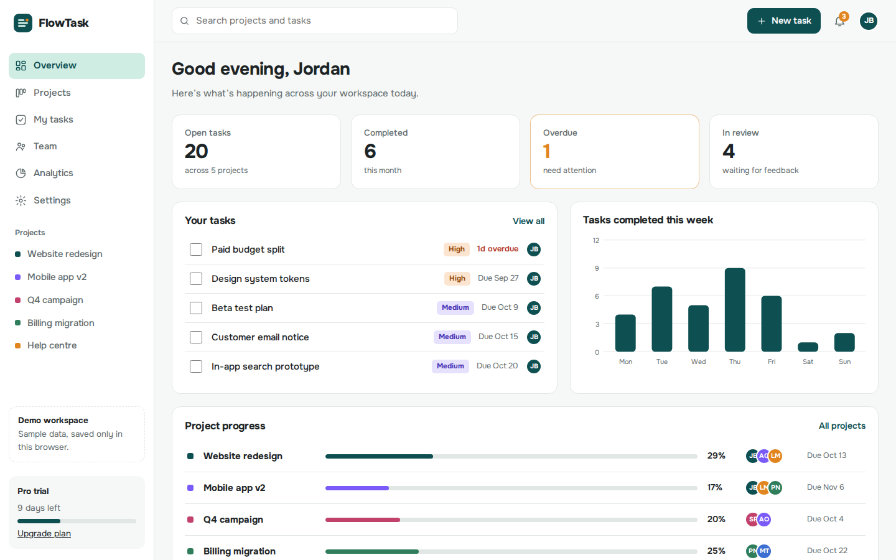
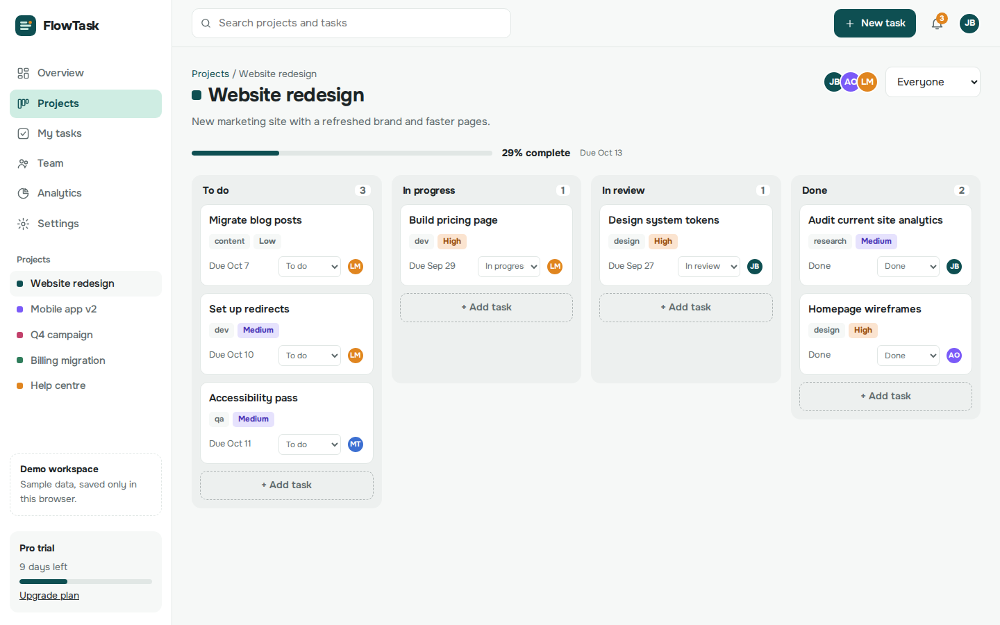
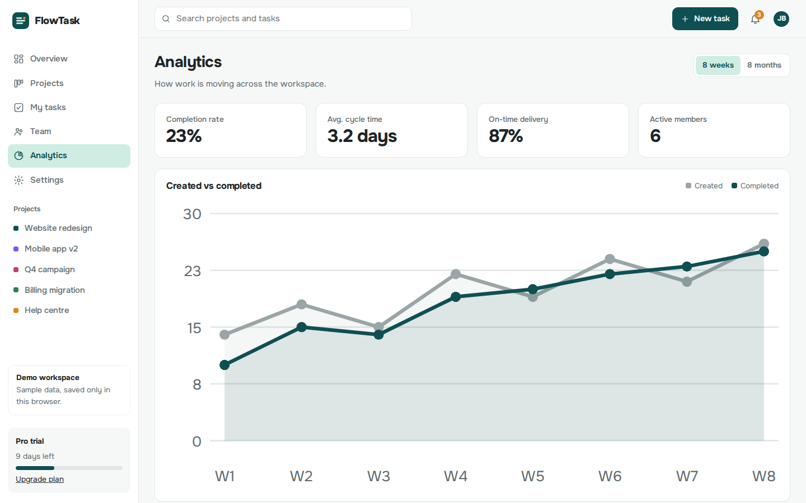
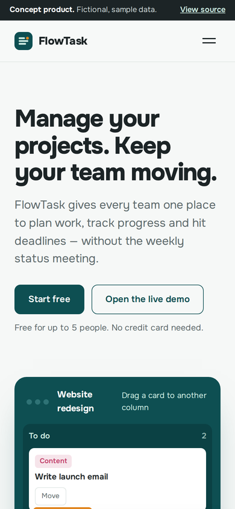
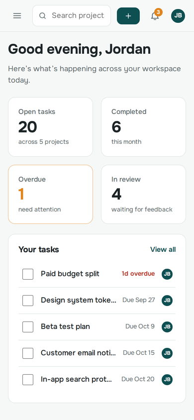

# FlowTask — SaaS landing page and dashboard

> **Concept project.** FlowTask is a fictional business created for a web design portfolio. All names, people, reviews, figures and prices are samples. No real orders, payments or messages are processed.

**[View the live demo →](https://gmoo7.github.io/flowtask/)**

A marketing website and a working application interface for a fictional project-management product.

## Features

- **Marketing site**: hero with a draggable mini board, features, how it works, pricing with a monthly/yearly toggle, testimonials, FAQ
- **Pricing page**: Free, Pro and Business tiers with a comparison table (sample pricing)
- **Log in and sign up** screens with validation
- **Dashboard**: overview, projects in grid or list view, kanban boards with drag and drop, task create/edit/delete, task filters, team workload and invites, analytics charts, notifications, global search, light and dark themes
- All changes are saved in the browser; Settings → Reset demo data restores the samples

Jump straight into the app: [gmoo7.github.io/flowtask/#/app](https://gmoo7.github.io/flowtask/#/app)

## Screenshots

|  |  |
|:--:|:--:|
| Home | Dashboard overview |
|  |  |
| Project board | Analytics |

### Mobile

 &nbsp; 

## Built with

Vue 3 (vendored, no CDN or build step), a small hash router, a reactive store with localStorage persistence, and hand-written SVG chart components. Fonts are self-hosted.

## Run it locally

Serve the folder with any static server, for example `npx serve .`

## Quality checks

Tested in Chromium at 360px, 390px and 1440px widths: no horizontal scrolling, no broken links, no JavaScript errors, and every button and form tested end to end.

---

Designed and built by [Hashir](https://github.com/GMoo7). Available for website projects for small and growing businesses.
